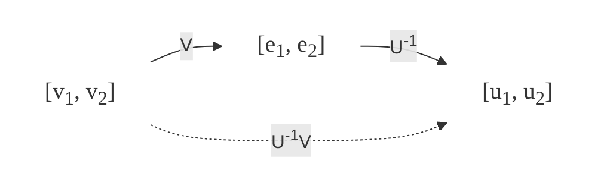
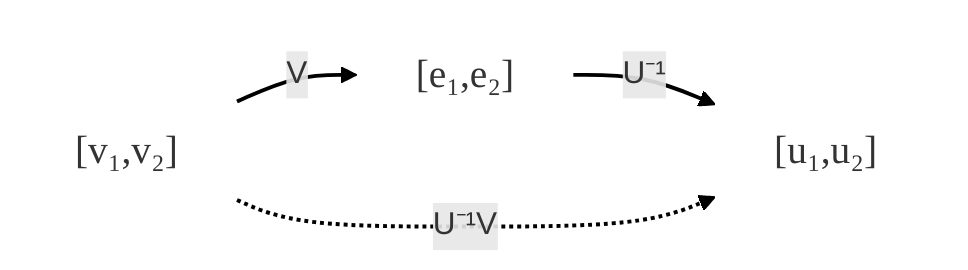

# 向量空间

> [!tip]
> 在本文档中我并没有严格按照向量需要斜体书写等什么加粗的书写规范,我只是想让你更好地理解向量空间的概念,所以我使用了普通的字体来书写向量.如果你需要严格的数学书写规范,请参考相关的数学教材.(也许当我回过头再来温习这些知识的时候,我会这些内容进行规范化的书写,谁知道呢?时间宝贵,我不想浪费时间在这些事情上.)
>
> 另外,文档配合Typora阅读效果更佳.

我们可以将$R^n$空间看成是所有元素都是实数的$n×1$矩阵的集合.用$R^{m×n}$表示所有元素都是实数的$m×n$矩阵的集合.
向量空间是一个数学概念,指的是一个由向量组成的集合,这些向量可以进行加法和数乘运算,并且满足一定的公理.向量空间的基本性质包括:

1. **加法封闭性**:向量空间中的任意两个向量相加,结果仍然是向量空间中的一个向量.
2. **数乘封闭性**:向量空间中的任意一个向量与任意一个标量相乘,结果仍然是向量空间中的一个向量.
3. **加法交换律**:向量空间中的任意两个向量相加,结果不受加法顺序的影响.
4. **加法结合律**:向量空间中的任意三个向量相加,结果不受加法顺序的影响.
5. **存在零向量**:向量空间中存在一个特殊的向量,称为零向量,它与任何向量相加都不改变该向量.
6. **存在负向量**:向量空间中的每个向量都有一个对应的负向量,与该向量相加结果为零向量.
7. **数乘分配律**:向量空间中的任意一个向量与任意两个标量相乘,结果等于先将向量与第一个标量相乘,再与第二个标量相乘.
8. **数乘结合律**:向量空间中的任意一个向量与任意一个标量相乘,结果等于先将向量与标量相乘,再与另一个标量相乘.
9. **数乘单位元**:向量空间中的任意一个向量与标量1相乘,结果仍然是该向量本身.

## 子空间

给定一个向量空间$V$,常常会用到在$V$上定义的运算意义下,$V$的一个子集$S$所构成的向量空间.由于$V$为向量空间,加法和标量乘法运算总是会得到$V$中的 一个向量.若要是$V$的子集$S$作为全集的系统成为向量空间,则$S$必须满足以下条件:

1. **非空性**:子集$S$必须至少包含一个向量,通常是零向量.

> 在向量空间$V$中,容易验证{0}和$V$是$V$的子空间.所有其他子空间成为真子空间.并且称{0}为零子空间,称$V$为平凡子空间.

2. **加法封闭性**:对于$S$中的任意两个向量$u$和$v$,它们的和$u + v$也必须在$S$中.==说明$S$在加法运算下是封闭的==.
3. **数乘封闭性**:对于$S$中的任意一个向量$u$和任意一个标量$c$,标量乘积$cu$也必须在$S$中.==说明$S$在数乘运算下是封闭的==.

> 为证明一个向量空间的子集$S$构成一个子空间,我们必须验证上述三个条件.由于每一个向量空间$V$都包含零向量,因此非空性条件通常是自动满足的.只需验证加法封闭性和数乘封闭性即可.

其中加法封闭性和数乘封闭性是向量空间的两个基本性质,它们确保了子集$S$在向量空间$V$的运算意义下仍然是一个向量空间.==向量空间的任何子空间仍为向量空间==.

### 矩阵的零空间

令$A$为$m×n$矩阵,则$A$的零空间是所有满足$Ax = 0$的解的集合.于是
$$
\text{N}(A) = \{x \in \mathbb{R}^n | Ax = 0\}
$$
我们说$N(A)$为$R^n$的子空间.显然$0∈N(A)$,因此$N(A)$是非空的.若$x∈N(A)$,且$α$为 标量,则
$$
A(αx) = αAx = α0 = 0
$$
因此$αx∈N(A)$.若$x,y∈N(A)$,则
$$
A(x + y) = Ax + Ay = 0 + 0 = 0
$$
因此$x + y∈N(A)$.由此得到$N(A)$是$R^n$的子空间.所有齐次方程$Ax = 0$的解的集合构成了$R^n$的一个子空间.子空间$N(A)$称为$A$的零空间,记作$N(A)$.零空间是一个向量空间,它包含所有使得$Ax = 0$的向量$x$.

### 向量集合的张成(其实就是线性组合)

**定义**令$v_1$, $v_2$, ..., $v_k$为$R^n$中的向量.$α_1$, $α_2$, ..., $α_k$为$R$中的标量.则向量$\alpha_1 v_1 + \alpha_2 v_2 + ... + \alpha_k v_k$称为$v_1$, $v_2$, ..., $v_k$的一个**线性组合**.所有这样的线性组合的集合称为$v_1$, $v_2$, ..., $v_k$的**张成**.记作$\text{span}(v_1, v_2, ..., v_k) = \{\alpha_1 v_1 + \alpha_2 v_2 + ... + \alpha_k v_k | \alpha_i \in \mathbb{R}\}$.

> 例题:$R^3$中向量$e_1$和$e_2$的张成为所有形如
$$
\alpha_1 e_1 + \alpha_2 e_2 = \begin{pmatrix}
\alpha_1 \\
\alpha_2 \\
0
\end{pmatrix}
$$
的向量的集合,其中$\alpha_1, \alpha_2 \in \mathbb{R}$.这表示$R^3$中所有在$e_1$和$e_2$的方向上的线性组合,即$Span(e_1,e_2)$为$R^3$的一个子空间,为$R^3$中的一个平面.这个子空间从空间上可以表示为所有在$e_1$和$e_2$的方向上的线性组合的向量集合($e_1$$e_2$平面内3维空间的向量).

**定理**若$v_1$,$v_2$,…,$v_n$为向量空间V中的元素,这$Span(v_1,v_2,…,v_n)$为$V$中的一个子空间.

**证**令β为标量，并令$v=α_1v_1+α_2v_2+…+α_nv_n$为$Span(v_1,v_2,…,v_n)$中的任意一个元素.由于
$$
\beta v = \beta(\alpha_1 v_1 + \alpha_2 v_2 + ... + \alpha_n v_n) = (\beta \alpha_1)v_1 + (\beta \alpha_2)v_2 + ... + (\beta \alpha_n)v_n
$$
因此$βv∈Span(v_1,v_2,…,v_n)$.若$v_1,v_2,…,v_n$为$Span(v_1,v_2,…,v_n)$中的任意两个元素,则
$$
v_1 + v_2 = (\alpha_1 + \alpha_2)v_1 + (\alpha_2 + \alpha_2)v_2 + ... + (\alpha_n + \alpha_n)v_n
$$
因此$v_1 + v_2∈Span(v_1,v_2,…,v_n)$.由此可知$Span(v_1,v_2,…,v_n)$是$V$的一个子空间.
一个$R^3$中的向量$x$属于$Span(e_1,e_2)$的充要条件是它落在3维空间$e_1e_2$的平面内.因此,几何上可以将$Span(e_1,e_2)$定义为$e_1e_2$的平面.类似的,给定两个两个向量$x$和$y$,若$(0,0,0),(x_1,x_2,x_3)$及$(y_1,y_2,y_3)$不共线,则这些点可以确定一个平面.若$z=c_1x+c_2y$,则$z$为平行于$x$和$y$的向量的和,因此必落在$x$和$y$所确定的平面内.==一般地,如果两个向量$x$和$y$可确定3维空间中的平面,则这个平面就是$Span(x,y)$的几何表示.==

### 向量空间的张集

令$v_1,v_2,…,v_n$为向量空间$V$中的向量，我们用$Span(v_1,v_2,…,v_n)$表示由向量$v_1,v_2,…,v_n$张成的$V$的子空间.可能有$Span(v_1,v_2,…,v_n) = V$的情形,此时,我们说向量$v_1,v_2,…,v_n$**张成**$V$.若$Span(v_1,v_2,…,v_n) = V$,则称$v_1,v_2,…,v_n$为$V$的一个**张集**.因此,向量空间的张集是指一组向量的集合,这些向量可以通过线性组合生成整个向量空间.
**定义**{$v_1,v_2,…,v_n$}是$V$的一个张集,当且仅当$Span(v_1,v_2,…,v_n) = V$.==即说明$V$中的每一个向量都可以表示为$v_1,v_2,…,v-n$的线性组合==.

### 回顾线性代数方程组

令$S$为一个相容的$m×n$线性方程组$Ax=b$的解集.若$b=0$,这$S=N(A),$因此其解集构成了$R^n$的一个子空间.若$b≠0$,则$S$不能构成$R^n$的一个子空间.但是如果可以找到一个特解$x_0$,则可以将任一解向量表示为$x_0$与一个$A$的零空间中向量$z$的和.
设$Ax=b$为一个相容的$m×n$线性方程组,$x_0$为它的特解.若$x_1$为方程组的另一个解,则差向量$z=x_1-x_0$必然在$N(A)$中,因为
$$
Az = A x_1 - A x_0 = b - b = 0
$$
故第二个解必然形如$x_1 = x_0 + z$,其中$z∈N(A)$.
一般地,若$x_0$为方程组$Ax = b$的一个特解,$z$为$N(A)$内的任一向量,若令$y = x_0 + z$,则
$$
Ay = A(x_0 + z) = Ax_0 + Az = b + 0 = b
$$
因此$y$也是方程组$Ax = b$的一个解.

通过上面的推导,我们得到一个结论:
**定理**若线性方程组$Ax = b$是相容的,$x_0$为方程组的一个特解,则向量$y$也为其解的充要条件是$y = x_0 + z$,其中$z∈N(A)$.==换句话说,$Ax = b$的解集是一个平行于$N(A)$的仿射子空间.==

## 线性无关

在这之前,我们限制向量空间为由有限个元素的集合生成的.向量空间中的每一个向量可由这些生成集合中的元素仅通过加法和标量乘法运算得到.生成集合通常称为张集.特别地,我们需要找打最小的张集.其中"最小"的含义是张集中的向量不能通过其他向量的线性组合得到(==集合中所有元素均为张成向量空间所必须的==).因此,我们需要定义一个概念,即向量的线性无关性(当然,与之对应的概念为线性相关).为理解如何求得最小的张集,我们需要考虑集合中的向量如何依赖于其他向量.==如果一个向量可以表示为其他向量的线性组合,则称这些向量是线性相关的.如果一个向量不能表示为其他向量的线性组合,则称这些向量是线性无关的.==这些简单的概念有助于我们理解向量空间的结构.

> 说明:
> (I)若$v_1,v_2,…,v_n$张成向量空间$V$,且其中一个向量可表示为其他$n-1$个向量的线性组合,则这$n-1$个向量张成向量空间$V$.
> (II)给定$n$个向量$v_1,v_2,…,v_n$,可将其中一个向量写为其他$n-1$个向量的线性组合的充要条件是存在不为零的标量$α_1,α_2,…,α_n$使得
$$
\alpha_1 v_1 + \alpha_2 v_2 + ... + \alpha_n v_n = 0.
$$

最小张集里的向量之间的关系应满足这样的关系:如果向量$v_1,v_2,…,v_n$是线性无关的,则不存在标量$α_1,α_2,…,α_n$使得
$$
\alpha_1 v_1 + \alpha_2 v_2 + ... + \alpha_n v_n = 0
$$
除非所有的$α_i$都为0.换句话说,线性不相关的向量不能被其他向量所组合得到0向量.

**证**(I)假设向量$v_n$可写为向量$v_1,v_2,…,v_n-1$的线性组合,即
$$
v_n = \beta_1 v_1 + \beta_2 v_2 + ... + \beta_{n-1} v_{n-1}
$$
令v为V中的任一元素.因为
$$
v = \alpha_1 v_1 + \alpha_2 v_2 + ... + \alpha_n v_n\\
= \alpha_1 v_1 + \alpha_2 v_2 + ... + \alpha_{n-1} v_{n-1} + \alpha_n (\beta_1 v_1 + \beta_2 v_2 + ... + \beta_{n-1} v_{n-1})\\
= (\alpha_1 + \alpha_n \beta_1)v_1 + (\alpha_2 + \alpha_n \beta_2)v_2 + ... + (\alpha_{n-1} + \alpha_n \beta_{n-1})v_{n-1}
$$
于是,任意$V$中的向量$v$可写成$v_1,v_2,…,v_n-1$的线性组合,因此这些向量张成向量空间$V$.
(II)设$v_1,v_2,…,v_n$中的一个向量,如$v_n$,可表示为其他$n-1$个向量的线性组合,即
$$
v_n = \alpha_1 v_1 + \alpha_2 v_2 + ... + \alpha_{n-1} v_{n-1}
$$
该方程两边同时减去$v_n$,得到
$$
\alpha_1 v_1 + \alpha_2 v_2 + ... + \alpha_{n-1} v_{n-1} - v_n = 0
$$
如果令$c_i=α_i,i = 1,2,…,n-1$及$c_n=-1$,则有
$$
c_1 v_1 + c_2 v_2 + ... + c_{n-1} v_{n-1} + c_n v_n = 0
$$
反之,如果
$$
c_1 v_1 + c_2 v_2 + ... + c_{n-1} v_{n-1} + c_n v_n = 0
$$
且$c_i$中至少有一个非零,不妨设为$c-n≠0$,则
$$
v_n = \frac{-c_1}{c_n} v_1 + \frac{-c_2}{c_n} v_2 + ... + \frac{-c_{n-1}}{c_n} v_{n-1}
$$

**定义**：如果向量空间V中的向量$v_1,v_2,…,v_n$满足
$$
c_1 v_1 + c_2 v_2 + ... + c_n v_n = 0
$$
就可以退出所有标量$c_1,c_2, ..., c_n$都为0,则称向量$v_1,v_2,…,v_n$为**线性无关**的.否则,称它们为**线性相关**的.
==最小张集称为**基**.==向量空间V的基是V的一个张集,其中的向量线性无关.因此,基是向量空间V中最小的张集.基的个数称为向量空间V的维数.

**定义**：如果存在不全为零的标量$c_1,c_2,…,c-n$,使得向量空间$V$中的向量$v_1,v_2,…,v-n$满足
$$
c_1 v_1+c_2 v_2+...+c_n v_n=0
$$
则称他们为**线性相关的**.

总结下来是如下的结论:
<!DOCTYPE html>
<html lang="en">
<head>
    <meta charset="UTF-8">
    <meta name="viewport" content="width=device-width, initial-scale=1.0">
    
</head>
<body>
    

        若存在非平凡的标量使得线性组合c1v1+c2v2+...+cnvn=0,则向量v1,v2,…,vn线性相关.如果线性组合c1v1+c2v2+...+cnvn=0仅当所有的ci=0时成立,则向量v1,v2,…,vn线性无关.线性无关的向量可以作为向量空间的基,而线性相关的向量不能作为基.
    

</body>
</html>
<b>定理</b>令x1,x2,…,xn为Rn中的向量,并令X=(x1,x2,…,xn).向量X1,X2,...,Xn线性相关的充要条件为X是奇异的.
利用该定理来判断Rn中的向量是否是线性无关:只需要简单地构造矩阵X,它的各列就是要测试的向量.为确定X是否为奇异的,可以计算X的行列式det(X).如果行列式不为0,则X是线性无关的.
但是对于Rn中的k个向量,无法通过行列式的方法确定矩阵是否奇异.为确定Rn中的k个向量是否线性无关,可以使用高斯消元法.通过将矩阵化为行最简形式,可以判断向量是否线性无关.如果行最简形式中有k个主元,则向量线性无关;如果主元少于k个,则向量线性相关.这里使用通俗的话来讲就是<mark>当且仅当X的行阶梯形含有自由变量时,方程组才有非平凡解,即向量线性相关.如果没有自由变量,则c=0是唯一的解,即向量线性无关</mark>.

**定理**设$v_1,v_2,…,v_n$为向量空间$V$中的向量.当且仅当$v_1,v_2,…,v_n$线性无关时,$Span(v_1,v_2,…,v_n)$中的任一向量$v$才可唯一地用向量$v_1,v_2,…,v-n$的线性组合表示.

### 函数的向量空间是否线性无关

对于向量空间$P_n$,为判断$P_n$中的向量是否线性无关,我们令
$$
c_1v_1 + c_2v_2 + ... + c_nv_n = z
$$
其中z表示零多项式:
$$
z = a_0 + a_1x + a_2x^2 + ... + a_nx^n = 0 x^{n-1} + 0 x^{n-2} + ... + 0x + 0
$$
若$c_1v_1+c_2v_2+...+c_nv_n$可写为$a_1x_{n - 1} + a_2x_{n - 2} + ... + a_{n - 1}x + a_n$的形式，则由于但且仅当多项式的系数相等时两个多项式才相等,故系数a~i~必须全为0.但每一个$a_i$均为$c_i$的一个线性组合.由此可以导出一个变量为$c_1,c_2,...,c_n$的齐次线性方程组.如果方程组仅有平凡解,则多项式是线性无关的;否则它们是线性相关的.

### 向量空间$C^{(n-1)}[a,b]$

这里省去一个为什么使用函数导数进行矩阵构造的描述(因为我还没有搞清楚这是为什么!).等我搞清楚了这解决这个空缺吧.

**定义**令$f_1,f_2,...,f_n$为$C^{(n-1)}[a,b]$中的函数,定义$[a,b]$上的函数$W[f_1,f_2,...,f_n]$为
$$
W[f_1,f_2,...,f_n] = \begin{vmatrix}
f_1 (x) & f_2 (x) & \cdots & f_n (x) \\
f_1' (x) & f_2' (x) & \cdots & f_n' (x) \\
\vdots & \vdots & \ddots & \vdots \\
f_1^{(n-1)} (x) & f_2^{(n-1)} (x) & \cdots & f_n^{(n-1)} (x)
\end{vmatrix}
$$
函数$W[f_1,f_2,...,f_n]$称为$f_1,f_2,...,f_n$的朗斯基行列式.

**定理**令$f_1,f_2,...,f_n$为$C^{(n-1)}[a,b]$中的元素.若在$[a,b]$中存在一个点$x_0$,使得$W[f_1,f_2,...,f_n](x_0)≠0$,则$f_1,f_2,...,f_n$线性无关.

## 基和维数

**定义**当且仅当向量空间V中的向量$v_1,v_2,...,v_n$满足
(1) $v_1,v_2,...,v_n$线性无关.
(2) $v_1,v_2,...,v_n$张成$V$.
称它们是向量空间$V$的基.

在许多应用中,需要寻找向量空间V的某个子空间.这可以通过找到子空间的基来实现.

**定理**若{$v_1,v_2,...,v_n$}为向量空间$V$的一个张集,则$V$中的任何$m$个向量必定线性相关,其中$m>n.$

若{$v_1,v_2,...,v_n$}和{$u_1~,u_2,...,u_n$}均为向量空间$V$的基,则$n=m$.

**定义**令$V$为一个向量空间.若$V$的一组基含有$n$个向量,我们称$V$的维数为$n$.$V$的子空间{$0$}的维数为0.如果有有限个向量张成$V$,则称$V$是有限维的;否则,称$V$是无限维的.

**定理**若$V$是维数$n$>0的向量空间,则:
(1)任意$n$个线性无关的向量张成$V$.
(2)任何张成$V$的$n$个向量是线性无关的.

**定理**若$V$是维数$n$>0的向量空间,则:
(1)少于$n$个向量的集合不能张成$V$.
(2)任何少于$n$个线性无关向量的子集均可扩展为$V$的一组基.
(3)任何多于$n$个向量的张集均可通过删除其中的向量得到$V$的一组基.

**标准基**就是我们能想到的,最为自然的一组描述向量空间的基.

## 基变换

### $R^2$中的坐标变换

$R^2$中的向量可以用标准基{$e_1,e_2$}表示.任何$R^2$中的向量$x$都可以表示为线性组合
$$
x = x_1 e_1 + x_2 e_2
$$
标量$x_1$和$x_2$可以看作是$x$在标准基{$e_1,e_2$}下的坐标.事实上,对任意$R^2$的基{$y,z$},给定向量$x$,可唯一地表示为线性组合
$$
x = \alpha y + \beta z
$$
其中$\alpha$和$\beta$称为$x$在基{$y,z$}下的坐标.对于基中的元素进行排序,使得$y$为第一个基向量,$z$为第二个基向量,并将这个有序的基记为$[y,z]$.然后称向量$(\alpha, \beta)^T$为$x$在基$[y,z]$下的坐标,记作$x_{[y,z]}$.

### 矩阵的坐标变换

一旦确定使用一组新的基,就需要寻找在这组基下的坐标.例如,假设我们希望用一组不同的基来替代$R^2$中的标准基{$e_1,e_2$}.不妨设
$$
u_1 = \begin{bmatrix}
3 \\
2
\end{bmatrix},
u_2 = \begin{bmatrix}
1 \\
1
\end{bmatrix}
$$
事实上,我们希望在两个坐标系之间进行转换.考虑下面两个问题:
1. 给定一个向量$x = (x_1, x_2)^T$,如何将它从标准基{$e_1, e_2$}转换为新基{$u_1, u_2$}?
2. 给定一个向量$y = (y_1, y_2)^T$,如何将它从新基{$u_1, u_2$}转换为标准基{$e_1, e_2$}?

我们首先求解第二个问题.因为它看上去是如此简单.为将基$[u_1, u_2]$转换为标准基$[e_1, e_2]$,我们必须将原来的基元素$u_1$和$u_2$表示为新的基元素$e_1,e_2$.
$$
u_1 = 3e_1 + 2e_2\\
u_2 = e_1 + e_2
$$
由此得到
$$
c_1u_1 + c_2u_2 = (3c_1e_1 + 2c_1e_2) + (c_2e_1 + c_2e_2) \\=  (3c_1 + c_2)e_1 + (2c_1 + c_2)e_2
$$
因此$c_1u_1 + c_2u_2$相应于$[e_1, e_2]$的坐标向量为
$$
x = \begin{bmatrix}
3c_1 + c_2 \\
2c_1 + c_2
\end{bmatrix} = \begin{bmatrix}
3 & 1\\
2 & 1
\end{bmatrix} \begin{bmatrix}
c_1 \\
c_2
\end{bmatrix}
$$
如果令
$$
U = \begin{bmatrix}
3 & 1\\
2 & 1
\end{bmatrix}
$$
则给定任何相应于$[u_1, u_2]$的坐标向量c,求相应于$[e_1, e_2]$的坐标向量x的公式为:
$$
x = Uc
$$
矩阵$U$称为从有序基$[u_1, u_2]$到基$[e_1, e_2]$的转移矩阵.

为求解第一个问题,我们需要求从$[e_1, e_2]$到$[u_1, u_2]$的转移矩阵.(30)中的矩阵$U$是非奇异的,因为它的列向量$u_1$, $u_2$线性无关.由(30)有
$$
c = U^{-1}x
$$
因此,给定向量
$$
x = (x_1,x_2)^t = x_1e_1 + x_2e_2
$$
我们只需要乘以$U^{-1}$即可求出在$[u_1, u_2]$下的坐标向量.$U^{-1}$为从$[e_1, e_2]$到$[u_1, u_2]$的转移矩阵.

下面考虑从一组$R^2$的基$[v_1,v_2]$到另一组基$[u_1,u_2]$的一般问题.此时,假设对给定的向量$x$,它对应于$[v_1,v_2]$的坐标已知:
$$
x =c_1v_1 + c_2v_2
$$
现在我们希望将$x$表示为和为$d_1u_1 + d_2u_2$.因此,必须求标量$d_1$和$d_2$,使得
$$
c_1v_1 + c_2v_2 = d_1u_1 + d_2u_2
$$
若令$V = ( v_1,v_2)$,且$U = ( u_1,u_2)$,则方程(35)可写为矩阵形式
$$
Vc = Ud
$$
由此可得到
$$
d = U^{-1}Vc
$$
因此,给定$R^2$中的向量$x$及其对应于有序基$[v_1,v_2]$的坐标向量c,要求$x$对应与新的基$[u_1,u_2]$的坐标向量,只需将$c$乘以转移矩阵$S = U^{-1}Vc$.

从$[v_1,v_2]$到$[u_1,u_2]$的转换可以看成一个两步过程首先.首先从$[v_1,v_2]$转换为标准基$[e_1,e_2]$,然后再从标准基转换为$[u_1,u_2]$.给定$R^2$中的向量$x$,若$c$为$x$相应于$[v_1,v_2]$的坐标向量,且$d$为$x$相应于$[u_1,u_2]$的坐标向量,则
$$
c_1v_1 + c_2v_2 = x_1e_1 + x_2e_2 = d_1u_1 + d_2u_2
$$
因为$V$是从$[v_1,v_2]$到$[e_1,e_2]$的转移矩阵,且$U^{-1}$是从$[e_1,e_2]$到$[u_1,u_2]$的转移矩阵,由此得到
$$
Vc = x 及 U^{-1}x = d
$$
于是
$$
U^{-1}Vc = U^{-1}x = d
$$
图解为

> 这里有个问题,我用mermaid来完成上下标的现实,但是Typora渲染出来的效果不对,为啥上下标实现不了,上标也显示成下标了,同样的代买在浏览器环境里就没有什么问题.很抽象.所以用下面的语法又写了一个.
> 上面的这个图使用Obsidian就可以正常渲染.哈哈,我没招了.

==如前所述,我们可以看到从$[v_1,v_2]$到$[u_1,u_2]$的转移矩阵为$U^{-1}V$.==

### 一般向量空间的基变换

**定义**令$V$为一向量空间,且令$E = [v_1,v_2,…,v_n]$为$V$的一组有序基.若$v$为$V$中的任一元素,则$v$可写为
$$
v = c_1v_1 + c_2v_2 + … + c_nv_n
$$
其中$c_1,c_2,…,c_n$为标量.因此可以将每一向量$v$唯一对应于$R^n$中的一个向量$c = (c_1,c_2,…,c_n)^T$.采用这种方式定义的向量$c$称为$v$相应于有续基$E$的坐标向量,并记为$[v]_E$,$c_i$称为$v$相对于$E$的坐标.
